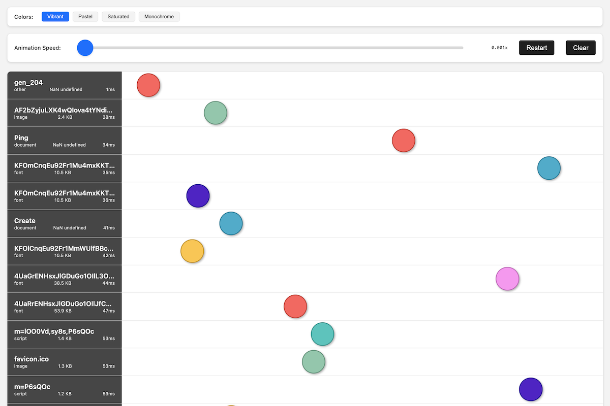
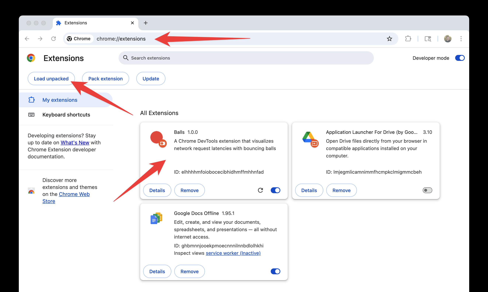

# Balls

A Chrome extension for visualizing resource load-time latencies with the worlds best visualization tool: bouncing balls.

This has been submitted for review to the Chrome extensions store but is not yet published.
If you'd like to use in the meantime:

1. Download this repository
2. Open Google Chrome
3. Navigate to `chrome://extensions/`
4. Click "Load unpacked" and select the directory containing this repository

5. You should see the "Balls" extension appear on your extensions list
